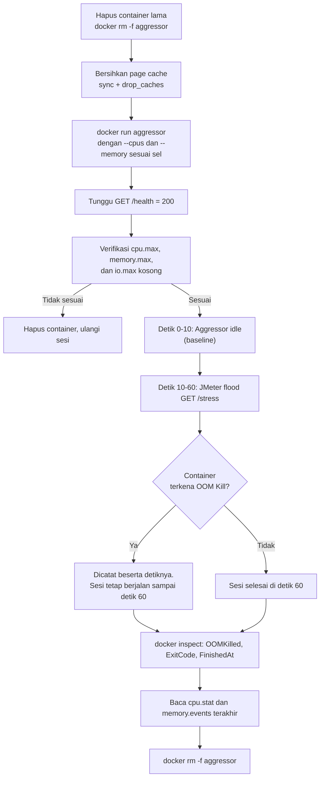

# Rekomendasi Alur, Struktur, dan Algoritma Aggressor Container

Dokumen ini merancang **Aggressor Container**, yaitu *container* yang menjadi sumber fenomena *noisy neighbor* pada Target Node. Rancangan mengikuti proposal (Bab 1.5, 2.6.1, 2.7.3, 3.2.3, 3.3.3, 3.3.4, 3.4.3) dan infrastruktur Terraform yang sudah dibuat.

> [!NOTE]
> Semua angka (iterasi hash, MB per *request*, target memori) adalah **nilai awal**. Nilai final ditetapkan lewat *pilot study* (Bab 3.3.4), lalu dikunci dan tidak berubah selama 80 sesi (Bab 3.3.3 poin 2).

---

## 1. Tujuan dan Prinsip Desain

Aggressor harus menyerap **CPU** dan **memori** *host* secara tidak terkendali ketika menerima *HTTP request flood*, tanpa ikut menjadi penyebab kegagalan lain. Prinsipnya diturunkan dari proposal:

| Prinsip | Alasan (proposal) |
|---|---|
| Endpoint *computationally-intensive* dan *memory-intensive* | Mereplikasi efek akhir HTTP *flood*: *resource exhaustion*, bukan habisnya *thread pool* (Bab 2.6.1) |
| Kode dan konfigurasi **identik** di seluruh sesi | Variabel kontrol (Bab 3.3.3 poin 2) |
| Layanan tidak boleh menjadi *bottleneck* sendiri | Gejala harus murni dari konsumsi CPU dan memori, bukan keterbatasan *framework* (Bab 2.7.3) |
| Pekerjaan CPU berupa **jumlah kerja tetap**, bukan durasi tetap | Saat di-*throttle*, *request* harus melambat dan antrean menumpuk, seperti kondisi nyata |
| Memori **ditahan** (tidak dilepas) dan benar-benar ditulis | Memori yang hanya dialokasikan tetapi belum disentuh tidak dihitung sebagai RSS |
| **Satu proses** (*single worker*) | Saat terkena *OOM Kill*, *container* berhenti dan tidak dihidupkan ulang oleh *process manager* (Bab 3.4.3.C) |
| Tanpa pembatasan Disk I/O (blkio) | Bab 2.5.3 |
| Aplikasi tidak menulis ke disk | Menjaga Disk I/O murni sebagai efek tidak langsung (*cross-resource*) |

---

## 2. Struktur Folder

```
apps/aggressor/
├── Dockerfile
├── requirements.txt       # versi dikunci eksak (hasil pip freeze)
├── app.py                 # FastAPI: /health, /stress, /stats
└── README.md              # catatan kalibrasi (opsional)
```

---

## 3. Endpoint

| Endpoint | Fungsi | Dipanggil oleh | Dibebani? |
|---|---|---|---|
| `GET /health` | Cek kesiapan (balas 200) | Skrip otomasi sebelum sesi dimulai | Tidak |
| `GET /stress` | **Pemicu *noisy neighbor***: alokasi memori + kerja CPU | JMeter selama fase *flood* | Ya |
| `GET /stats` | Melaporkan memori yang ditahan (untuk kalibrasi) | Peneliti saat *pilot study* | Tidak |

JMeter memanggil `/stress` **tanpa parameter**. Intensitas ditentukan variabel lingkungan yang tetap, bukan *query string*. Dengan begitu profil beban tidak bisa berubah antar sesi.

| Variabel lingkungan | Nilai awal | Makna |
|---|---|---|
| `CPU_ITERATIONS` | 100 | Jumlah pemrosesan SHA-256 atas blok 64 KiB per *request* (±20 ms CPU, dikalibrasi) |
| `MEM_MB_PER_REQ` | 4 | MB yang ditambahkan dan ditahan per *request* |
| `MEM_TARGET_MB` | 640 | Total memori yang ingin ditahan; setelah tercapai, tidak menambah lagi (lihat bagian 5) |

---

## 4. Algoritma Pemicu

### 4.1 Pekerjaan CPU (jumlah kerja tetap)

```
fungsi burn_cpu(iterations):
    h = SHA256()
    ulangi iterations kali:
        h.update(BLOCK)          # BLOCK = 64 KiB data acak, dibuat sekali saat start
    kembalikan h.hexdigest()
```

- Jumlah kerja tetap membuat waktu per *request* bergantung pada CPU yang tersedia. Saat `cpu.max` membatasi, tiap *request* memakan waktu lebih lama dan antrean menumpuk.
- `hashlib` melepas GIL untuk blok data besar, jadi CPU benar-benar terpakai oleh kode C, bukan sekadar interpreter Python.

### 4.2 Pekerjaan memori (tahan dan sentuh)

```
fungsi grab_memory():
    dengan lock:
        jika held_mb + MEM_MB_PER_REQ > MEM_TARGET_MB:
            kembalikan False                    # target tercapai, tidak menambah
        held_mb += MEM_MB_PER_REQ
    buf = bytearray(0xA5) * (MEM_MB_PER_REQ * 1 MiB)   # mengisi semua halaman
    HELD.append(buf)                                    # ditahan selamanya
    kembalikan True
```

- `bytearray(n)` biasa belum menyentuh halaman memori (alokasi *lazy*). Karena itu buffer **diisi nilai non-nol** agar halaman menjadi RSS sungguhan.
- Memori tidak pernah dilepas selama *container* hidup, sehingga tekanan terus naik sampai target atau sampai `memory.max` terlampaui.

### 4.3 Handler `/stress`

```
GET /stress:
    target_tercapai = tidak grab_memory()
    burn_cpu(CPU_ITERATIONS)
    kembalikan { "mem_held_mb": held_mb, "target_reached": target_tercapai }
```

Urutan **memori dulu, baru CPU** dipilih supaya memori naik secepat mungkin pada awal fase *flood*.

### 4.4 Kerangka `app.py`

```python
import hashlib
import os
import threading
import time

from fastapi import FastAPI

CPU_ITERATIONS = int(os.getenv("CPU_ITERATIONS", "100"))
MEM_MB_PER_REQ = int(os.getenv("MEM_MB_PER_REQ", "4"))
MEM_TARGET_MB = int(os.getenv("MEM_TARGET_MB", "640"))

MB = 1024 * 1024
BLOCK = os.urandom(64 * 1024)   # blok tetap, dibuat sekali
HELD = []                       # memori yang sengaja ditahan
held_mb = 0
lock = threading.Lock()
started_at = time.time()

app = FastAPI()


def burn_cpu(iterations: int) -> str:
    h = hashlib.sha256()
    for _ in range(iterations):
        h.update(BLOCK)
    return h.hexdigest()


def grab_memory() -> bool:
    global held_mb
    with lock:
        if held_mb + MEM_MB_PER_REQ > MEM_TARGET_MB:
            return False
        held_mb += MEM_MB_PER_REQ
    HELD.append(bytearray(b"\xa5") * (MEM_MB_PER_REQ * MB))  # menulis seluruh halaman
    return True


@app.get("/health")
def health():
    return {"status": "ok"}


@app.get("/stress")
def stress():
    grabbed = grab_memory()
    burn_cpu(CPU_ITERATIONS)
    return {"mem_held_mb": held_mb, "target_reached": not grabbed}


@app.get("/stats")
def stats():
    return {"mem_held_mb": held_mb, "uptime_s": round(time.time() - started_at, 1)}
```

> [!TIP]
> Handler memakai `def` biasa (bukan `async def`) agar FastAPI menjalankannya di *thread pool*. Handler `async` yang menjalankan kerja CPU akan memblokir *event loop* dan membuat `/health` ikut macet. Jumlah *thread* bawaan 40 sekaligus membatasi konkurensi.

---

## 5. Keputusan Desain Krusial: Memori Berbatas atau Tanpa Batas

Ini keputusan yang paling memengaruhi hasil dan **perlu Anda putuskan sebelum pilot study**.

Kriteria efektivitas pada Tabel 3.4.2 mensyaratkan ***Aggressor OOM Kill Frequency* = 0**. Jika Aggressor menahan memori tanpa batas (*leak*), maka **semua** level memori (256, 512, 768 MB) pasti terkena *OOM Kill*. Akibatnya seluruh kolom memori berbatas otomatis "Tidak Efektif", dan *heatmap* kehilangan variasi.

| | Opsi A: Tanpa batas (*leak* sampai plafon) | Opsi B: **Target memori tetap** (`MEM_TARGET_MB`) |
|---|---|---|
| Perilaku | Memori naik terus sampai plafon pengaman *host* | Memori naik sampai target lalu mendatar |
| 256 dan 512 MB | *OOM Kill* | *OOM Kill* jika target lebih besar dari limit |
| 768 MB | *OOM Kill* | **Aman** jika target < 768 MB |
| Tanpa limit | Tekanan memori *host* besar | Tekanan memori sesuai target |
| Variasi pada *heatmap* | Rendah (kolom memori seragam) | **Lebih baik** (ada gradasi antar level) |
| Selaras dengan Bab 3.4.6 | Sebagian | Ya, memisahkan kegagalan karena OOM dari kegagalan di sisi *Victim* |

**Rekomendasi: Opsi B**, dengan `MEM_TARGET_MB` di antara dua level memori. Nilai awal 640 MB berarti 256 dan 512 MB pasti memicu *OOM Kill*, sedangkan 768 MB bisa bertahan.

Konsekuensi yang harus dicatat di Bab 3:
- Target memori adalah **parameter beban** yang dikunci dan harus disebut sebagai variabel kontrol (Bab 3.3.3 poin 2).
- Dengan target 640 MB, tekanan memori pada Sel 1 lebih ringan (RSS Aggressor ±640 MB dari 2048 MB). Dampak utama pada Sel 1 tetap datang dari CPU. Jika tekanan memori terlalu lemah untuk menunjukkan *cross-resource side-effects*, naikkan target (misalnya 900 MB), tetapi semua level memori akan memicu *OOM Kill*.
- Target harus diputuskan lewat *pilot*, bukan sekadar tebakan.

### Perkiraan waktu menuju *OOM Kill*

Asumsi kasar: RSS awal ±80 MB, ±20 ms CPU per *request* (maksimum ±50 *request*/detik per 1 vCPU penuh), 4 MB per *request*. Angka ini perlu diverifikasi saat *pilot*.

| Batas CPU | *Request*/detik | Laju memori | Mencapai 256 MB | Mencapai 512 MB | Mencapai target 640 MB |
|---|---|---|---|---|---|
| Tanpa limit (100%) | ±50 | ±200 MB/s | ±0,9 s | ±2,2 s | ±2,8 s |
| 75% | ±37 | ±150 MB/s | ±1,2 s | ±2,9 s | ±3,7 s |
| 50% | ±25 | ±100 MB/s | ±1,8 s | ±4,3 s | ±5,6 s |
| 25% | ±12 | ±50 MB/s | ±3,5 s | ±8,6 s | ±11,2 s |

Pembatasan CPU ikut memperlambat laju pertumbuhan memori karena memori hanya ditambah saat *request* diproses. Ini interaksi CPU dan memori yang akan terlihat pada *time-series*.

---

## 6. Dockerfile dan Cara Menjalankan

### Dockerfile (kerangka)

```dockerfile
FROM python:3.12-slim

ENV PYTHONUNBUFFERED=1 \
    CPU_ITERATIONS=100 \
    MEM_MB_PER_REQ=4 \
    MEM_TARGET_MB=640

WORKDIR /app
COPY requirements.txt .
RUN pip install --no-cache-dir -r requirements.txt
COPY app.py .

EXPOSE 8000
# Satu worker; tanpa access log agar tidak menambah aktivitas I/O
CMD ["uvicorn", "app:app", "--host", "0.0.0.0", "--port", "8000", \
     "--workers", "1", "--no-access-log", "--log-level", "warning"]
```

> [!IMPORTANT]
> Kunci versi `python`, `fastapi`, dan `uvicorn` secara eksak (reprodusibilitas, Bab 3.2.3). Catat hasil `pip freeze` dan tag *image* di Bab 3.

### Perintah `docker run` per konfigurasi

```bash
docker run -d --name aggressor --restart=no -p 8000:8000 \
    [--cpus=<X>] [--memory=<Y>m] \
    aggressor:1.0
```

Tidak ada opsi blkio (`--device-read-bps`, `--blkio-weight`, dan sebagainya) pada seluruh sesi.

| Level | Opsi Docker | Isi berkas cgroups v2 yang diharapkan |
|---|---|---|
| CPU tanpa limit | (tidak ada) | `cpu.max` = `max 100000` |
| CPU 75% | `--cpus=0.75` | `cpu.max` = `75000 100000` |
| CPU 50% | `--cpus=0.50` | `cpu.max` = `50000 100000` |
| CPU 25% | `--cpus=0.25` | `cpu.max` = `25000 100000` |
| Memori tanpa limit | (tidak ada) | `memory.max` = `max` |
| Memori 768 MB | `--memory=768m` | `memory.max` = `805306368` |
| Memori 512 MB | `--memory=512m` | `memory.max` = `536870912` |
| Memori 256 MB | `--memory=256m` | `memory.max` = `268435456` |
| Disk I/O | (tidak dikonfigurasi) | `io.max` kosong atau tidak ada |

Dengan *cgroup driver* `systemd`, berkas berada di `/sys/fs/cgroup/system.slice/docker-<id-lengkap>.scope/`. Skrip verifikasi membaca jalur ini dan membandingkannya dengan tabel di atas sebelum sesi dimulai (Bab 3.4.4.D).

---

## 7. Perilaku yang Diharapkan dan Bukti yang Dicatat

| Kondisi | Yang terjadi pada Aggressor | Bukti |
|---|---|---|
| CPU dibatasi | Tiap *request* melambat, antrean menumpuk | `nr_throttled` dan `throttled_usec` pada `cpu.stat` naik |
| Memori melampaui `memory.max` | Proses utama dibunuh *OOM Killer*, *container* berhenti (exit code 137) | `docker inspect`: `State.OOMKilled=true`; `memory.events`: `oom_kill` naik |
| Target memori tercapai (tanpa OOM) | Memori mendatar, CPU tetap jenuh | `/stats` dan `docker stats`: memori stabil |
| Tanpa limit sama sekali (Sel 1) | Menyerap CPU dan memori *host* sesuai kapasitas | Metrik *host* dan *Victim Latency* memburuk |

> [!WARNING]
> Setelah *container* berhenti, direktori cgroup-nya dihapus, sehingga `memory.events` tidak bisa dibaca lagi. Skrip pemantau harus **menyimpan pembacaan terakhir** (*latch*), dan status `State.OOMKilled` dari `docker inspect` dijadikan **sumber kebenaran** untuk *Aggressor OOM Kill Frequency*. Baca `docker inspect` **sebelum** `docker rm`.

### Dugaan arah hasil pada *heatmap* (Opsi B, target 640 MB)

| | Memori tanpa limit | 768 MB | 512 MB | 256 MB |
|---|---|---|---|---|
| CPU tanpa limit | Sel 1 (kontrol) | Mungkin gagal di sisi *Victim* | Gagal (OOM) | Gagal (OOM) |
| CPU 75% / 50% / 25% | Berpotensi **Efektif** | Berpotensi **Efektif** | Gagal (OOM) | Gagal (OOM) |

Ini hanya dugaan untuk membantu kalibrasi, bukan hasil. Pilot harus memastikan variasi seperti ini benar-benar muncul (Bab 3.3.4).

---

## 8. Siklus Hidup Aggressor dalam Satu Sesi



Poin penting:
- Selama baseline (detik 0 sampai 10), tidak ada trafik ke `/stress`.
- `--restart=no` memastikan *container* yang mati tidak hidup lagi dalam sesi yang sama.
- Sesi **tidak** diulang karena *OOM Kill*. Itu hasil sah. Sesi hanya diulang jika verifikasi limit gagal.

---

## 9. Prosedur Kalibrasi (*Pilot Study*)

1. **Ukur RSS saat diam.** Jalankan *container* tanpa beban, lalu cek `docker stats`. Nilainya harus jauh di bawah 256 MB (target ±80 MB). Ini menjustifikasi batas bawah 256 MB (Bab 3.3.4.C).
2. **Kalibrasi `CPU_ITERATIONS`.** Kirim *request* ke `/stress` satu per satu pada Sel 1, ukur CPU time per *request*. Atur `CPU_ITERATIONS` hingga ±20 ms.
3. **Cek kejenuhan CPU.** Pada Sel 1, *Host CPU Utilization* selama *flood* harus mendekati 100%.
4. **Kalibrasi laju memori.** Pastikan `MEM_MB_PER_REQ` membuat memori mencapai target dalam sekitar 3 sampai 15 detik, sehingga masih tersisa waktu pengamatan sebelum detik 60.
5. **Putuskan `MEM_TARGET_MB`** (bagian 5) dengan melihat sel-sel pilot.
6. **Cek degradasi pada Sel 1.** *Victim Latency* P95 harus naik jelas terhadap *baseline*. Jika tidak, naikkan intensitas Aggressor (bukan ubah desain eksperimen).
7. **Cek Sel 16 (CPU 25%, memori 256 MB).** *Container* harus bisa *start*, lolos `/health`, dan menerima *flood* (Bab 3.3.4).
8. **Catat semua nilai final** ke Bab 3 dan Bab 4, lalu kunci.

---

## 10. Risiko dan Mitigasi

| Risiko | Dampak | Mitigasi |
|---|---|---|
| *Host* kehabisan memori (Sel 1) | SSH dan Docker daemon ikut mati, sesi rusak | `MEM_TARGET_MB` sebagai plafon; cek sisa memori di *pilot* |
| Efek Sel 1 terlalu lemah | RM1 tidak terbukti | Naikkan intensitas lewat parameter beban, bukan desain |
| `async` memblokir *event loop* | `/health` macet, hasil tidak jelas | Handler `def` biasa |
| Alokasi *lazy* tidak menaikkan RSS | Tekanan memori tidak muncul | Buffer diisi nilai non-nol |
| *Worker* ganda | *OOM Kill* hanya mematikan satu *worker*, *container* tetap hidup | `--workers 1` |
| Log aplikasi menulis ke disk | Mengacaukan metrik Disk I/O | `--no-access-log`, `--log-level warning` |
| Log Docker (`json-file`) menulis ke disk | Sama | Pertimbangkan `--log-driver none` untuk **kedua** *container* secara konsisten |
| Versi *image*/pustaka berubah | Hasil tidak reprodusibel | Kunci versi dan catat tag |
| Respons terlalu besar | Beban jaringan ikut bertambah | Respons JSON kecil |

---

## 11. Checklist

- [ ] `app.py` memakai `def` biasa dan satu *worker*
- [ ] Buffer memori ditulis penuh (bukan alokasi *lazy*)
- [ ] Nilai `CPU_ITERATIONS`, `MEM_MB_PER_REQ`, `MEM_TARGET_MB` ditetapkan lewat *pilot* dan dikunci
- [ ] Keputusan Opsi A/B dicatat dan dijustifikasi di Bab 3
- [ ] Versi Python, FastAPI, Uvicorn, dan tag *image* dikunci
- [ ] `--restart=no` pada semua sesi
- [ ] Tidak ada opsi blkio pada `docker run`
- [ ] `docker inspect` dibaca sebelum `docker rm`
- [ ] RSS saat diam jauh di bawah 256 MB
- [ ] Sel 1 menunjukkan degradasi *Victim Latency* yang jelas
