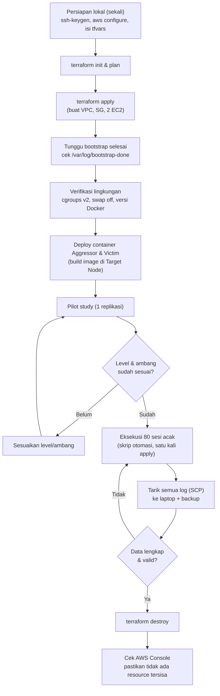

# Rekomendasi Struktur dan Alur Terraform (Hemat Biaya)

Dokumen ini menjadi panduan menyiapkan infrastruktur AWS untuk penelitian *"Efektivitas Konfigurasi Isolasi Cgroups dalam Memitigasi Noisy Neighbor"*. Isinya disesuaikan dengan arsitektur pada proposal (Bab 3.2 dan 3.4.1).

---

## 1. Prinsip Hemat Biaya

| Prinsip | Penerapan |
|---|---|
| **Ephemeral** | `apply` hanya saat eksperimen, `destroy` setelah log ditarik |
| **Satu kali apply untuk 80 sesi** | Tidak `destroy` di tengah eksperimen agar tidak ada variasi *host* fisik antar-*instance* |
| **Satu AZ** | Tanpa biaya transfer antar-AZ, latensi konsisten |
| **IP privat untuk lalu lintas uji** | JMeter menembak Target Node lewat IP privat |
| **Tanpa NAT Gateway** | NAT Gateway (±$0,045/jam + data) lebih mahal dari seluruh eksperimen |
| **EBS minimum** | 20 GB gp3 per instance (bisa 12-15 GB) |
| **Budget alarm** | Notifikasi bila tagihan melewati ambang kecil |

### Estimasi biaya (us-east-1, On-Demand)

| Komponen | Tarif | 10 jam | 730 jam (24/7) |
|---|---|---|---|
| EC2 t2.small (Target) | $0,023/jam | $0,23 | $16,79 |
| EC2 t3.medium (Attacker) | $0,0416/jam | $0,42 | $30,37 |
| EBS gp3 2 x 20 GB | $0,08/GB-bulan | ±$0,02 | $3,20 |
| IPv4 publik (2 buah) | $0,005/jam/IP | $0,10 | $7,30 |
| Kredit CPU *unlimited* surplus | $0,05/vCPU-jam | < $0,10 | - |
| **Total** | | **± $0,85-$1,10** | **± $58+** |

> [!NOTE]
> Tarif dapat berubah. Verifikasi ulang pada AWS Pricing Calculator sebelum eksperimen.

---

## 2. Struktur Folder

```
noisy-neighbor-research/
├── terraform/
│   ├── versions.tf           # versi Terraform & provider (dikunci)
│   ├── providers.tf          # provider AWS, region, default_tags
│   ├── variables.tf          # deklarasi variabel
│   ├── terraform.tfvars      # nilai variabel (JANGAN di-commit jika berisi IP pribadi)
│   ├── data.tf               # AMI Ubuntu 22.04, AZ, caller identity
│   ├── network.tf            # VPC, subnet, IGW, route table
│   ├── security.tf           # Security Group
│   ├── keypair.tf            # key pair (dibuat lokal, public key diunggah)
│   ├── compute.tf            # EC2 Target Node & Attacker Node
│   ├── budget.tf             # AWS Budget alarm
│   ├── outputs.tf            # IP, perintah SSH/SCP
│   ├── user_data/
│   │   ├── target_node.sh    # Docker 27.x, swap off, sysstat, psutil
│   │   └── attacker_node.sh  # JRE, JMeter, Python
│   └── .gitignore
├── scripts/
│   ├── deploy.ps1            # wrapper: terraform apply + tunggu siap
│   ├── destroy.ps1           # wrapper: tarik log lalu terraform destroy
│   ├── automation/           # skrip otomasi 80 sesi (Attacker Node)
│   └── monitor/              # skrip pemantau (Target Node)
├── jmeter/                   # file .jmx
├── apps/
│   ├── aggressor/            # FastAPI + Dockerfile
│   └── victim/               # Nginx
└── results/                  # log hasil unduhan (di luar Git atau pakai .gitignore)
```

### `.gitignore` yang disarankan
```
.terraform/
*.tfstate
*.tfstate.*
*.tfvars
*.pem
crash.log
results/
```

---

## 3. Isi Tiap File (Ringkas)

### `versions.tf`
```hcl
terraform {
  required_version = ">= 1.6.0"
  required_providers {
    aws = {
      source  = "hashicorp/aws"
      version = "~> 5.0"
    }
  }
}
```

### `providers.tf`
```hcl
provider "aws" {
  region = var.region
  default_tags {
    tags = {
      Project = "noisy-neighbor-research"
      Owner   = "elgin"
    }
  }
}
```

### `variables.tf`
```hcl
variable "region"                 { default = "us-east-1" }
variable "target_instance_type"   { default = "t2.small" }
variable "attacker_instance_type" { default = "t3.medium" }
variable "volume_size_gb"         { default = 20 }
variable "allowed_ssh_cidr"       { description = "IP publik Anda, format x.x.x.x/32" }
variable "public_key_path"        { default = "~/.ssh/noisy-neighbor.pub" }
variable "budget_limit_usd"       { default = 5 }
variable "budget_email"           { description = "Email penerima notifikasi budget" }
```

### `data.tf`
```hcl
data "aws_availability_zones" "available" { state = "available" }

data "aws_ami" "ubuntu_2204" {
  most_recent = true
  owners      = ["099720109477"] # Canonical
  filter {
    name   = "name"
    values = ["ubuntu/images/hvm-ssd/ubuntu-jammy-22.04-amd64-server-*"]
  }
}
```
> [!TIP]
> Untuk reprodusibilitas (Bab 3.2.3), setelah AMI terpilih pertama kali, kunci ke satu AMI ID tertentu (ganti `most_recent` dengan `ami = "ami-xxxx"`) dan catat di Bab 3.

### `network.tf`
```hcl
resource "aws_vpc" "main" {
  cidr_block           = "10.0.0.0/16"
  enable_dns_hostnames = true
  tags = { Name = "nn-vpc" }
}

resource "aws_internet_gateway" "igw" {
  vpc_id = aws_vpc.main.id
}

resource "aws_subnet" "public" {
  vpc_id                  = aws_vpc.main.id
  cidr_block              = "10.0.1.0/24"
  availability_zone       = data.aws_availability_zones.available.names[0]
  map_public_ip_on_launch = true
}

resource "aws_route_table" "public" {
  vpc_id = aws_vpc.main.id
  route {
    cidr_block = "0.0.0.0/0"
    gateway_id = aws_internet_gateway.igw.id
  }
}

resource "aws_route_table_association" "public" {
  subnet_id      = aws_subnet.public.id
  route_table_id = aws_route_table.public.id
}
```

### `security.tf`
```hcl
resource "aws_security_group" "nn" {
  name   = "nn-sg"
  vpc_id = aws_vpc.main.id

  # SSH hanya dari IP peneliti
  ingress {
    from_port   = 22
    to_port     = 22
    protocol    = "tcp"
    cidr_blocks = [var.allowed_ssh_cidr]
  }

  # Seluruh lalu lintas internal antar node (JMeter -> container, SCP, dll.)
  ingress {
    from_port = 0
    to_port   = 0
    protocol  = "-1"
    self      = true
  }

  egress {
    from_port   = 0
    to_port     = 0
    protocol    = "-1"
    cidr_blocks = ["0.0.0.0/0"]
  }
}
```

### `keypair.tf`
```hcl
resource "aws_key_pair" "main" {
  key_name   = "nn-key"
  public_key = file(pathexpand(var.public_key_path))
}
```
Buat key pair lokal terlebih dahulu: `ssh-keygen -t ed25519 -f ~/.ssh/noisy-neighbor`

### `compute.tf`
```hcl
resource "aws_instance" "target" {
  ami                    = data.aws_ami.ubuntu_2204.id
  instance_type          = var.target_instance_type
  subnet_id              = aws_subnet.public.id
  vpc_security_group_ids = [aws_security_group.nn.id]
  key_name               = aws_key_pair.main.key_name
  user_data              = file("${path.module}/user_data/target_node.sh")

  # t2 default-nya "standard", harus diubah eksplisit
  credit_specification { cpu_credits = "unlimited" }

  root_block_device {
    volume_type           = "gp3"
    volume_size           = var.volume_size_gb
    iops                  = 3000
    throughput            = 125
    delete_on_termination = true
  }
  tags = { Name = "nn-target-node", Role = "target" }
}

resource "aws_instance" "attacker" {
  ami                    = data.aws_ami.ubuntu_2204.id
  instance_type          = var.attacker_instance_type
  subnet_id              = aws_subnet.public.id
  vpc_security_group_ids = [aws_security_group.nn.id]
  key_name               = aws_key_pair.main.key_name
  user_data              = file("${path.module}/user_data/attacker_node.sh")

  credit_specification { cpu_credits = "unlimited" }

  root_block_device {
    volume_type           = "gp3"
    volume_size           = var.volume_size_gb
    iops                  = 3000
    throughput            = 125
    delete_on_termination = true
  }
  tags = { Name = "nn-attacker-node", Role = "attacker" }
}
```

### `budget.tf`
```hcl
resource "aws_budgets_budget" "monthly" {
  name         = "nn-research-budget"
  budget_type  = "COST"
  limit_amount = tostring(var.budget_limit_usd)
  limit_unit   = "USD"
  time_unit    = "MONTHLY"

  notification {
    comparison_operator        = "GREATER_THAN"
    threshold                  = 80
    threshold_type             = "PERCENTAGE"
    notification_type          = "ACTUAL"
    subscriber_email_addresses = [var.budget_email]
  }
}
```

### `outputs.tf`
```hcl
output "target_public_ip"    { value = aws_instance.target.public_ip }
output "target_private_ip"   { value = aws_instance.target.private_ip }
output "attacker_public_ip"  { value = aws_instance.attacker.public_ip }
output "attacker_private_ip" { value = aws_instance.attacker.private_ip }

output "ssh_target"   { value = "ssh -i ~/.ssh/noisy-neighbor ubuntu@${aws_instance.target.public_ip}" }
output "ssh_attacker" { value = "ssh -i ~/.ssh/noisy-neighbor ubuntu@${aws_instance.attacker.public_ip}" }
```

### `user_data/target_node.sh` (garis besar)
```bash
#!/bin/bash
set -euxo pipefail
# 1. Matikan swap permanen (Bab 3.4.4.E)
swapoff -a
sed -i '/swap/d' /etc/fstab
# 2. Paket dasar
apt-get update
apt-get install -y sysstat python3-pip python3-psutil ca-certificates curl
# 3. Docker Engine 27.x (pin versi) dengan cgroup driver systemd
#    -> ikuti dokumentasi resmi Docker untuk repo apt, pin: docker-ce=5:27.*
# 4. /etc/docker/daemon.json: {"exec-opts": ["native.cgroupdriver=systemd"]}
# 5. Verifikasi cgroups v2: stat -fc %T /sys/fs/cgroup  -> "cgroup2fs"
touch /var/log/bootstrap-done
```

### `user_data/attacker_node.sh` (garis besar)
```bash
#!/bin/bash
set -euxo pipefail
apt-get update
apt-get install -y openjdk-17-jre-headless python3-pip unzip
# Unduh Apache JMeter (pin versi) ke /opt/jmeter
touch /var/log/bootstrap-done
```

---

## 4. Alur Kerja (Workflow)



### Langkah operasional

1. **Persiapan lokal (sekali):** install Terraform dan AWS CLI, jalankan `aws configure`, buat key pair SSH, isi `terraform.tfvars`.
2. **`terraform init` lalu `terraform plan`:** periksa rencana sebelum membuat resource.
3. **`terraform apply`:** infrastruktur siap dalam beberapa menit. Catat IP dari output.
4. **Tunggu bootstrap:** SSH ke tiap node dan pastikan `/var/log/bootstrap-done` ada.
5. **Verifikasi lingkungan:** `stat -fc %T /sys/fs/cgroup` harus `cgroup2fs`. `free -h` harus menunjukkan swap 0. `docker version` harus 27.x.
6. **Deploy aplikasi:** salin `apps/aggressor` dan `apps/victim` ke Target Node, lalu build image.
7. **Pilot study:** satu replikasi, validasi level dan ambang (Bab 3.3.4).
8. **80 sesi utama:** jalankan skrip otomasi di Attacker Node dalam satu sesi `tmux`/`screen` agar tidak putus jika SSH terputus.
9. **Tarik log:** SCP ke laptop dan simpan salinan cadangan **sebelum** destroy.
10. **`terraform destroy`:** hapus semua resource. Cek Console (EC2, EBS, Elastic IP) agar tidak ada sisa.

---

## 5. Otomasi Wrapper (Opsional)

`scripts/destroy.ps1` mencegah kehilangan data:

```powershell
# Tarik log dulu, destroy hanya jika berhasil
$ip = terraform -chdir=../terraform output -raw attacker_public_ip
scp -i $HOME/.ssh/noisy-neighbor -r ubuntu@${ip}:~/results ../results/
if ($LASTEXITCODE -eq 0) {
    terraform -chdir=../terraform destroy -auto-approve
} else {
    Write-Error "Gagal menarik log. Destroy dibatalkan."
}
```

---

## 6. Risiko dan Mitigasi

| Risiko | Dampak | Mitigasi |
|---|---|---|
| Lupa `destroy` | Biaya ±$1,9/hari | Budget alarm, pengingat jadwal |
| Log hilang saat destroy | Eksperimen harus diulang | Wrapper tarik log dulu, simpan cadangan |
| SSH putus saat 80 sesi | Eksperimen terhenti | Jalankan di `tmux`/`screen` |
| Instance baru di host fisik berbeda | Variasi antar-run | Satu `apply` untuk seluruh 80 sesi |
| Kredit CPU t2 mode `standard` | *Throttling* dari AWS, bukan cgroups | `cpu_credits = "unlimited"` eksplisit |
| IP publik SSH terbuka | Risiko keamanan | `allowed_ssh_cidr` hanya IP `/32` milik Anda |
| IP publik berubah di rumah/kampus | SSH ditolak | Perbarui `allowed_ssh_cidr` lalu `apply` ulang |
| Versi Docker/AMI berubah | Hasil tak reprodusibel | Pin versi Docker dan AMI ID |

---

## 7. Checklist Sebelum Eksperimen

- [ ] `terraform.tfvars` terisi (IP, email, path public key)
- [ ] Budget alarm aktif dan email terverifikasi
- [ ] `cpu_credits = "unlimited"` pada kedua instance
- [ ] AMI dan versi Docker dikunci
- [ ] cgroups v2 terverifikasi (`cgroup2fs`)
- [ ] Swap nonaktif (`free -h`)
- [ ] `io.max` tidak terkonfigurasi
- [ ] Skrip otomasi berjalan dalam `tmux`/`screen`
- [ ] Rencana tarik log dan cadangan siap
- [ ] Tahu perintah `terraform destroy` dan cek Console setelahnya
